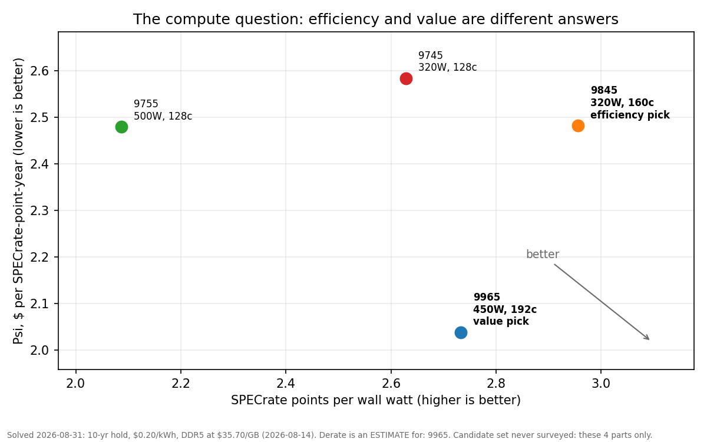

# ohms-razor: the report

This file is the repo's output. One page, entirely solved from `data/` by
`python scripts/build_tables.py`; nothing here is hand-typed. For the terminal version of
the answer alone, run `python scripts/answer.py`. For mechanisms, sensitivities, and what
would falsify each finding, see `analysis/`.

<!-- gen:last_solved -->
**Last solved:** 2026-08-31. **3 figure(s) past their freshness window** (run `python scripts/check_staleness.py`).
<!-- /gen:last_solved -->

## The answer

<!-- gen:the_answer -->
```text
THE COMPUTE QUESTION  (deterministic work: builds, simulation, batch jobs)
  own it           AMD EPYC 9965 at $2.04 per SPECrate-point-year all-in over 10 years
  renting instead  4.2x to 8.1x the cost of owning, same unit
  watts binding?   AMD EPYC 9845 is the efficiency pick at 2.96 pts per wall watt

THE TOKENS QUESTION  (thinking)
  default          glm-5.3-flash: AA 57, $0.045/task, $1,915 for the 10-yr reference workload at list ($958 on promo through 2026-09-09)
  frontier calls   grok-4.6: AA 60, $0.62/task, the cheapest costed frontier point (13.8x default per task)
  local inference  no: the best passing local config runs 3.3x cloud cost at AA 24
  the local box    hosts the agent: orchestration, sandboxes, a small resident triage model

Caveats, solved with the answer: kimi-k3, glm-5.3-max, claude-opus-5 sit at or above the frontier pick's score with no cost per task yet (TODO in data/benchmarks.yaml); the pick re-solves when they are costed. kimi-k3 is the one frontier model with API pricing here and prices the reference workload at $52,542 (27.4x default), which is why the frontier tier is for rare calls, not the loop. Every price is VOLATILE; run scripts/check_staleness.py before trusting. And the harder caveat: 3 candidate sets (CPU candidates for the compute node, hosted models for the token tiers, local machines for on-box inference) have never been surveyed for entrants, so these picks are the best of an inherited list, not the best available. Run /refresh-data to re-open them.
```
<!-- /gen:the_answer -->

## The findings behind it

<!-- gen:findings_summary -->
| # | Finding | Solved right now | Data date |
|---|---|---|---|
| F1 | Renting beats self-hosting for the reference workload | glm-5.3-flash (list): $1,915 for 10 years at AA 57, cheapest capable path at list price | 2026-08-29 |
| F2 | There is no midrange tier | Pareto frontier runs $0.045/task (AA 57) to $0.62/task (AA 60); everything between is dominated | 2026-08-26 |
| F3 | Local hardware fails the throughput bar before it fails on cost | Bar is 9.98 tok/s sustained; 1 of 4 tested configs clears it on measured numbers | 2026-08-29 |
| F4 | Even when local passes, it loses | $0.56/M local vs $0.17/M cloud, same weights, fully saturated: 3.3x | 2026-08-29 |
| F5 | The local box is for hosting, not inference | Thesis; see README | |
| F6 | The hardware scarcity is a supply story, not a demand story | Two defensible readings; both presented in analysis 06 | 2026-08-25 |
| F7 | Owning beats renting for deterministic compute | AMD EPYC 9965 at $2.04/pt-yr; renting runs 4.2x to 8.1x owning | 2026-06-15 |
<!-- /gen:findings_summary -->




## How wide was the search?

<!-- gen:survey_status -->
| Candidate set | In catalog | Fully placeable | Last surveyed | Status |
|---|---:|---|---|---|
| CPU candidates for the compute node | 4 | 4 priced, 4 screenable | never | **never surveyed** |
| hosted models for the token tiers | 4 | see report | never | **never surveyed** |
| local machines for on-box inference | 4 | see report | never | **never surveyed** |
| the capability axis itself | 7 | 2 costed | 2026-08-26 | current |

3 of 4 candidate sets were inherited from the original research and have never been re-opened. Every ranking drawn from them is "best of these", not "best available". Run `python scripts/refresh_plan.py` for the survey scope and where to look, or `/refresh-data` to have an agent do it.
<!-- /gen:survey_status -->

## How much to trust it today

<!-- gen:freshness -->
| Category | Figures | Oldest | Window | Status |
|---|---:|---|---|---|
| benchmarks | 1 | 2026-08-26 | 60d | fresh |
| dram | 1 | 2026-08-14 | 14d | **1 flagged** |
| hardware_pricing | 10 | 2026-06-15 | 30d | **2 flagged** |
| model_pricing | 5 | 2026-08-29 | 30d | fresh |

SPECrate submissions never expire and are not policed.
<!-- /gen:freshness -->

Confidence tags and freshness windows are defined in `CONTRIBUTING.md`. If the tables
above disagree with `python scripts/answer.py`, run `python scripts/build_tables.py`;
the docs are stale, the solver is not.
