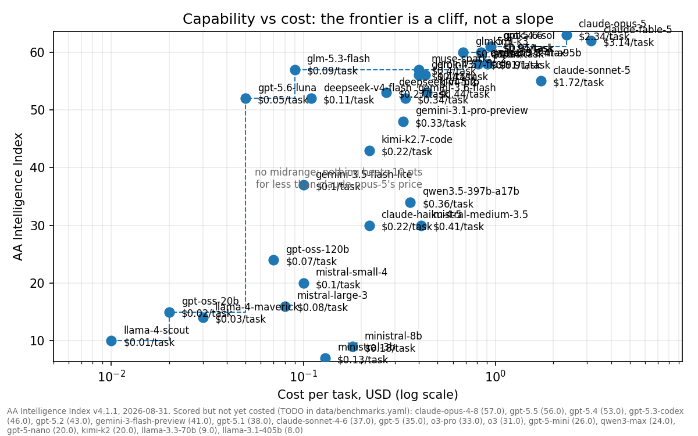

# Token economics: latest

The tokens question (what do I use for thinking), solved from `data/` by `python scripts/sotw.py tokens`. Nothing here is hand-typed; git history is the archive of previous states.

**Last solved:** 2026-08-29. **3 figure(s) past their freshness window** (run `python scripts/check_staleness.py`).

## The answer

```text
THE TOKENS QUESTION  (thinking)
  default          glm-5.3-flash: AA 57, $0.045/task, $1,915 for the 10-yr reference workload at list ($958 on promo through 2026-09-09)
  frontier calls   grok-4.6: AA 60, $0.62/task, the cheapest costed frontier point (13.8x default per task)
  local inference  no: the best passing local config runs 3.3x cloud cost at AA 24
  the local box    hosts the agent: orchestration, sandboxes, a small resident triage model

Caveats, solved with the answer: kimi-k3, glm-5.3-max, claude-opus-5 sit at or above the frontier pick's score with no cost per task yet (TODO in data/benchmarks.yaml); the pick re-solves when they are costed. kimi-k3 is the one frontier model with API pricing here and prices the reference workload at $52,542 (27.4x default), which is why the frontier tier is for rare calls, not the loop. Every price is VOLATILE; run scripts/check_staleness.py before trusting.
```

## The reference workload

```text
315,000,000 output tokens/yr / 31,557,600 s/yr = 9.98 tok/s
sustained, 24/7/365, zero downtime

over 10 years at 80% cache hit:
  3.15B output tokens
  1.26B fresh input tokens
  5.04B cached input tokens
```

## Every priced path

| Path | 10-yr cost | AA score | Priced | Confidence |
|---|---:|---:|---|---|
| gpt-oss-120b-cloud (list) | $724 | 24 | 2026-08-29 | VOLATILE |
| glm-5.3-flash (promo) | $958 | 57 | 2026-08-29 | EXPIRES, ends 2026-09-09 |
| glm-5.3-flash (list) | $1,915 | 57 | 2026-08-29 | VOLATILE |
| deepseek-v4-flash (off-peak only) | $2,391 | 52 | 2026-08-29 | VOLATILE |
| deepseek-v4-flash (24/7, 29% peak) | $3,089 | 52 | 2026-08-29 | VOLATILE |
| kimi-k3 (list) | $52,542 | 60 | 2026-08-29 | VOLATILE |

Scores: AA Intelligence Index v4.1.1 (2026-08-26). Index parity is not task parity.

## The cache objection, priced

| Cache hit rate | glm-5.3-flash | deepseek-v4-flash (off-peak) | gap |
|---:|---:|---:|---:|
| 0% | $2,520 | $3,465 | $945 |
| 25% | $2,331 | $3,130 | $799 |
| 50% | $2,142 | $2,794 | $652 |
| 75% | $1,953 | $2,459 | $506 |
| 80% | $1,915 | $2,391 | $476 |
| 100% | $1,764 | $2,123 | $359 |

DeepSeek's cache rate ($0.007/M vs $0.030/M) is worth at most $145 on this volume even if every input token were cached, against a $504 output-price gap. The ranking cannot flip on cache behavior.

## The frontier is a cliff

| Model | AA score | $/task | vs glm-5.3-flash | Pareto |
|---|---:|---:|---:|---|
| glm-5.3-flash | 57 | $0.045 | 1.0x | on frontier |
| grok-4.6 | 60 | $0.620 | 13.8x | on frontier |
| deepseek-v4-flash | 52 | TODO: unverified | | not placeable yet |
| kimi-k3 | 60 | TODO: unverified | | not placeable yet |
| glm-5.3-max | 60 | TODO: unverified | | not placeable yet |
| claude-opus-5 | 63 | TODO: unverified | | not placeable yet |
| gpt-oss-120b | 24 | TODO: unverified | | not placeable yet |

Midrange models the handoff places at 2x to 14x glm-5.3-flash per task while scoring at or below it (individual figures pending re-pull): gpt-5.6-luna, deepseek-v4-pro, glm-5.2, qwen3.8-27b, gemini-3.7-flash, grok-4.5, muse-spark.



## The local throughput bar

| Machine | Price | Bandwidth (GB/s) | Max mem | Model | tok/s | Model 2 bound | vs 9.98 tok/s |
|---|---:|---|---:|---|---|---|---|
| Mac mini M6 | $899 | 170 nominal | 32GB | dense-70b q4 | n/a |  | **fails on capacity** |
| Mac mini M5 Pro | $1,699 | 307 nominal | 64GB | dense-70b q4 | 5.5 (ESTIMATE) |  | fails the bar |
| GMKtec EVO-X2 (Strix Halo) | $1,499 | 256 nominal / 215 measured | 128GB | dense-70b q4 | 5 (ESTIMATE) | <= 5 | fails the bar |
| GMKtec EVO-X2 (Strix Halo) | $1,499 | 256 nominal / 215 measured | 128GB | gpt-oss-120b mxfp4 | 31 (MEASURED) | <= 80 | **passes** |
| Mac Studio M5 Ultra | $15,000 (est.) | 1200 nominal | 512GB | moe-671b q4 | 32 (ESTIMATE) |  | **passes** |

The Model 2 column is the bandwidth-bound upper bound; measured figures below their bound reflect routing and kernel overhead, and measured always wins an argument with the bound.

## The saturated local box still loses

| Quantity | Value |
|---|---:|
| Box | GMKtec EVO-X2 (Strix Halo), gpt-oss-120b, 5 yr, fully saturated |
| Capex | $1,499 |
| Electricity (5 yr) | $1,227.24 |
| All-in | $2,726.24 |
| Lifetime output | 4.89B tokens |
| Local cost | $0.56/M output |
| Cheapest cloud, same weights | $0.17/M output |
| Local vs cloud | 3.3x |
| Break-even utilization | 3.3 (above 1.0 = impossible) |

Capability context: gpt-oss-120b scores 24 on the AA index. The volume API tier (glm-5.3-flash) scores 57 at $0.045/task. The local option costs more per token and delivers less than half the capability.

## Batching, modelled

gpt-oss-120b: 117B total, 5.1B active, 128 experts, top-4 routing. Sparsity ratio R = 22.9: you buy memory for 117B and get throughput from 5.1B.

| Batch | Aggregate bound (tok/s) | Per-stream bound | Resident weights per stream |
|---:|---:|---:|---:|
| 1 | 80 | 80 | 117.0B |
| 2 | 94 | 47 | 58.5B |
| 4 | 106 | 27 | 29.2B |
| 8 | 118 | 15 | 14.6B |
| 16 | 137 | 9 | 7.3B |
| 32 | 173 | 5 | 3.7B |
| 64 | 255 | 4 | 1.8B |

First-order model (uniform independent routing), measured Strix Halo bandwidth, ESTIMATE throughout. The measured single-stream rate is 31 tok/s against a 80 tok/s bound, a 2.6x overhead factor; scale the whole curve down accordingly. Measured batching curves are the top item on the open-questions list.

## How much to trust this today

| Category | Figures | Oldest | Window | Status |
|---|---:|---|---|---|
| benchmarks | 1 | 2026-08-26 | 60d | fresh |
| dram | 1 | 2026-08-14 | 14d | **1 flagged** |
| hardware_pricing | 10 | 2026-06-15 | 30d | **2 flagged** |
| model_pricing | 5 | 2026-08-29 | 30d | fresh |

SPECrate submissions never expire and are not policed.
